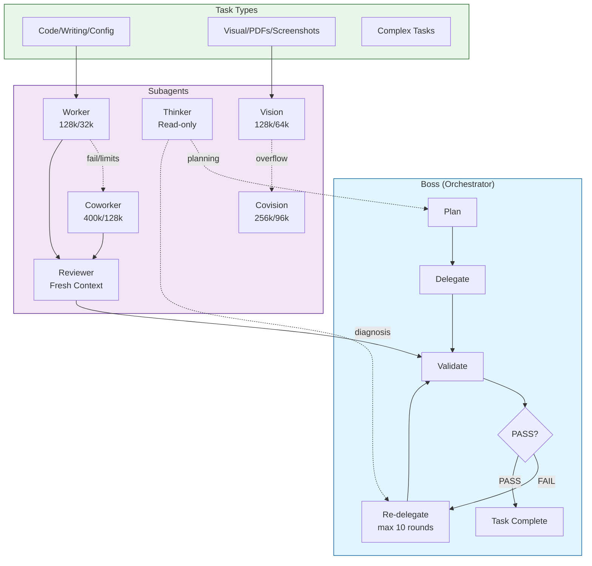

# Agents

Configuration files and instructions for AI coding assistants like opencode, claude-code, and similar tools.

**SECURITY NOTICE**: This repository contains example configuration files with placeholder API keys. **Never commit real API keys to git.** Use environment variables (`{env:VAR_NAME}`) or the `/connect` command in opencode instead. See [Security Warning](#security-warning) below.

## Contents

- `AGENTS.md` - General instructions for AI coding agents to follow when working on tasks
- `opencode/` - Configuration for [opencode](https://opencode.ai/) TUI
  - `opencode.json` - Main configuration file with providers, MCP servers, permissions, and agents
  - `commands/` - Slash commands for common workflows (standup, mail, orchestration, review)
  - `prompts/` - Agent system prompts (boss, altboss, worker, coworker, reviewer, thinker, vision, covision, build)
  - `skills/` - Reusable instruction modules for common tasks (git-checkpoint, mac-mail, standup-coordination, task-execution, frontend-design)

## Installation

### Quick Setup

1. **Clone this repo** to a location of your choice (replace `<REPO_CLONE_PATH>` with your preferred directory):
   ```bash
   git clone <repo-url> <REPO_CLONE_PATH>/agents
   # Example: git clone <repo-url> ~/repos/agents
   ```

2. **Install opencode config files** to the proper location (`~/.config/opencode/`):
   
   **Option A: Copy files (simplest)**
   ```bash
   mkdir -p ~/.config/opencode/commands
   cp <REPO_CLONE_PATH>/agents/opencode/opencode.json ~/.config/opencode/
   cp <REPO_CLONE_PATH>/agents/opencode/commands/*.md ~/.config/opencode/commands/
   mkdir -p ~/.config/opencode/prompts
   cp <REPO_CLONE_PATH>/agents/opencode/prompts/*.md ~/.config/opencode/prompts/
   cp -r <REPO_CLONE_PATH>/agents/opencode/skills/* ~/.config/opencode/skills/
   ```
   
   **Option B: Create symlinks (keeps files in sync with repo)**
   ```bash
   mkdir -p ~/.config/opencode/commands
   ln -sf <REPO_CLONE_PATH>/agents/opencode/opencode.json ~/.config/opencode/opencode.json
   for f in <REPO_CLONE_PATH>/agents/opencode/commands/*.md; do
       ln -sf "$f" ~/.config/opencode/commands/
   done
   mkdir -p ~/.config/opencode/prompts
   for f in <REPO_CLONE_PATH>/agents/opencode/prompts/*.md; do
       ln -sf "$f" ~/.config/opencode/prompts/
   done
   mkdir -p ~/.config/opencode/skills
   for d in <REPO_CLONE_PATH>/agents/opencode/skills/*/; do
       skill_name=$(basename "$d")
       ln -sf "$d" ~/.config/opencode/skills/"$skill_name"
   done
   ```

3. **Configure placeholder values** in `~/.config/opencode/opencode.json`:
   - Replace `<YOUR_*_MODEL>` placeholders with your preferred models
   - Replace `<YOUR_WORKING_DIR>` with your projects directory
   - API keys - See [Security Warning](#security-warning) below

### Security Warning

**DO NOT paste API keys directly into `opencode.json` if this file is in a git repository or shared location.**

Use environment variables instead:
```json
{
  "provider": {
    "google": {
      "options": { "apiKey": "{env:GOOGLE_GEMINI_API_KEY}" }
    }
  }
}
```

Then set in your shell profile:
```bash
export GOOGLE_GEMINI_API_KEY="your-key-here"
```

## Multi-Agent Orchestration

The boss orchestration system uses a Plan → Delegate → Validate → Re-delegate cycle with specialized subagents for different tasks.

### Architecture Overview



### Execution Flow

1. **Plan**: Boss reads standup.md and creates an execution plan, consulting @thinker for complex scenarios
2. **Delegate**: Boss spawns subagents in parallel for independent tasks
   - Code/config tasks → `worker` (cost-effective, 128k context)
   - Visual tasks → `vision` (128k context) or `covision` for heavy payloads (256k context)
   - Complex tasks → `coworker` (400k context, fallback)
3. **Validate**: Boss delegates verification to `reviewer` for independent fresh-eyes quality check
4. **Re-delegate**: If reviewer returns FAIL, boss re-delegates fixes (max 10 rounds per task)
5. **Escalate**: On repeated failures, boss consults `thinker` for diagnosis

### Agent Context/Output Limits

| Agent | Context | Output | Purpose |
|-------|---------|--------|---------|
| worker | 128k | 32k | Cost-effective task execution |
| coworker | 400k | 128k | Fallback for complex/large tasks (3x context, 4x output) |
| reviewer | 128k | 32k | Independent quality verification |
| vision | 128k | 64k | Visual tasks, screenshots, PDFs |
| covision | 256k | 96k | Heavy visual payloads, large PDFs |
| thinker | varies | varies | Read-only strategic planning |

### Commands

```bash
/go-boss      # Start boss orchestration (recommended)
/go-altboss   # Alternative boss with different model
/review-loop  # Fresh-eyes review: N workers sequentially review/fix
```

## Agents

| Agent | Mode | Model | Purpose |
|-------|------|-------|---------|
| `task` | primary | `<YOUR_PREFERRED_TASK_MODEL>` | Default task execution |
| `build` | primary | `<YOUR_STRONGER_MODEL>` | Code implementation and writing |
| `plan` | primary | `<YOUR_STRONGER_MODEL>` | Planning and architecture |
| `boss` | primary | `<YOUR_STRONGER_MODEL>` | Orchestration with Plan/Delegate/Validate/Re-delegate |
| `altboss` | primary | `<YOUR_STRONGER_MODEL>` | Alternative boss with different model |
| `simple` | primary | `<YOUR_LIGHTWEIGHT_MODEL>` | Simple tasks with minimal overhead |
| `worker` | subagent | `<YOUR_WORKER_MODEL>` | Cost-effective task execution |
| `coworker` | subagent | `<YOUR_FALLBACK_MODEL>` | Fallback for complex tasks |
| `reviewer` | subagent | `<YOUR_WORKER_MODEL>` | Independent quality verification |
| `thinker` | subagent | `<YOUR_STRONGER_MODEL>` | Read-only strategic planning |
| `vision` | subagent | `<YOUR_VISION_MODEL>` | Visual tasks and PDF analysis |
| `covision` | subagent | `<YOUR_HEAVY_VISION_MODEL>` | Heavy-duty visual fallback |

## Slash Commands

### Orchestration & Task Management

| Command | Description |
|---------|-------------|
| `/go-boss` | Start boss orchestration with Plan/Delegate/Validate/Re-delegate cycle |
| `/go-altboss` | Start altboss orchestration (alternative model) |
| `/review-loop` | Fresh-eyes review loop: N workers sequentially review/fix subtasks |
| `/add-todo` | Create GitHub issues from DETAILED-TODO items (today/tomorrow) |
| `/add-done` | Add DONE items from closed issues/PRs (today/tomorrow) |
| `/standup-create` | Convert DETAILED-TODOs to standup TODO bullets |
| `/standup-update` | Update standup.md after completing tasks |
| `/open-standup` | Open Safari with project boards and issue/PR links |
| `/post-standup` | Post standup to Discord (test/prod/dry-run modes) |

### Mail & Communication

| Command | Description |
|---------|-------------|
| `/mail-search` | Search Apple Mail for emails and correspondence |

## Customizing Paths

The configuration uses placeholders that you must customize:

### Path Placeholders
- `<YOUR_WORKING_DIR>` → Your projects directory (e.g., `~/repos/`)
- `<MAIL_SCRIPT_PATH>` → Path to scripts directory
- `<NOTES_PATH>` → Path to your notes directory

### Model Placeholders
- `<YOUR_STRONGER_MODEL>` → Stronger model for orchestration
- `<YOUR_WORKER_MODEL>` → Worker model for cost-effective execution
- `<YOUR_FALLBACK_MODEL>` → Fallback model (400k context)
- `<YOUR_VISION_MODEL>` → Vision model for visual tasks
- `<YOUR_HEAVY_VISION_MODEL>` → Heavy vision model (256k context)

## Updating Configurations

```bash
# If using symlinks, changes are automatic after restart
# If using copies:
cp <REPO_CLONE_PATH>/agents/opencode/opencode.json ~/.config/opencode/
cp <REPO_CLONE_PATH>/agents/opencode/commands/*.md ~/.config/opencode/commands/
cp <REPO_CLONE_PATH>/agents/opencode/prompts/*.md ~/.config/opencode/prompts/
```

## Troubleshooting

**Config not loading:**
- Verify files are in `~/.config/opencode/`
- Check JSON syntax: `python -m json.tool ~/.config/opencode/opencode.json`

**Commands not appearing:**
- Ensure command files are in `~/.config/opencode/commands/`
- Check files have `.md` extension and proper frontmatter

**Agent not found:**
- Verify agent names match what you're invoking
- Check `mode` is set correctly (`primary` or `subagent`)

## License

MIT
