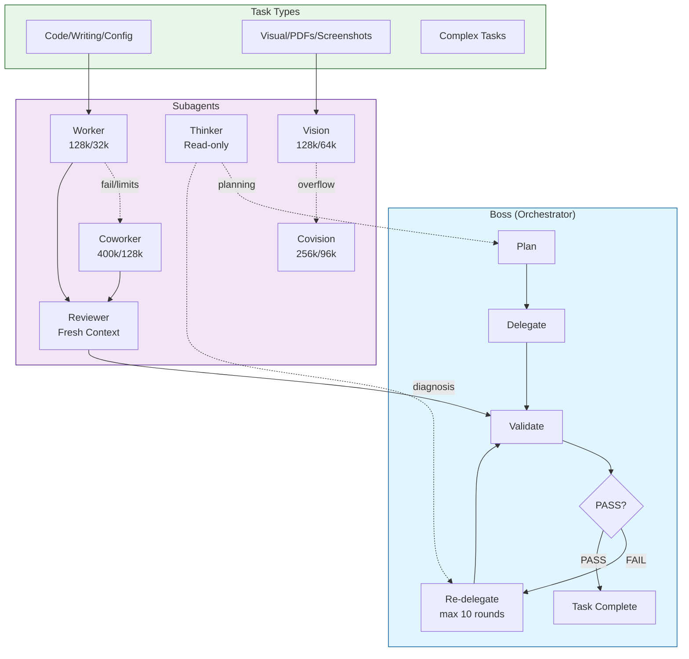

# OpenCode Multi-Agent Configuration

A production-ready multi-agent orchestration system for OpenCode implementing a Plan → Delegate → Validate → Re-delegate cycle with specialized subagents.

## Architecture



## How It Works

### 1. Plan
Boss reads `standup.md` and creates an execution plan. For complex scenarios (5+ tasks, unfamiliar codebase), it consults `@thinker` for strategic planning.

### 2. Delegate
Boss spawns subagents in parallel for independent tasks:

| Task Type | Agent | Context/Output |
|-----------|-------|----------------|
| Code/Config/Writing | `worker` | 128k/32k |
| Visual (PDFs, Screenshots) | `vision` | 128k/64k |
| Heavy Visual Payloads | `covision` | 256k/96k |
| Complex/Large Tasks | `coworker` | 400k/128k |

### 3. Validate
Boss delegates verification to `@reviewer` for independent fresh-eyes quality checks. Review depth:
- **critical**: Important records, LaTeX with citations, data-sensitive content
- **standard**: Code, config, general writing

### 4. Re-delegate
If reviewer returns FAIL, boss re-delegates fixes (max 10 rounds). On round 3, boss consults `@thinker` for diagnosis.

## Agent Reference

| Agent | Mode | Context | Output | Purpose |
|-------|------|---------|--------|---------|
| boss | primary | varies | varies | Orchestration, planning, verification |
| altboss | primary | varies | varies | Alternative orchestrator |
| worker | subagent | 128k | 32k | Cost-effective execution |
| coworker | subagent | 400k | 128k | Fallback for complex tasks |
| reviewer | subagent | 128k | 32k | Independent quality verification |
| thinker | subagent | varies | varies | Read-only strategic planning |
| vision | subagent | 128k | 64k | Visual tasks, screenshots, PDFs |
| covision | subagent | 256k | 96k | Heavy-duty visual fallback |

## Commands

```bash
/go-boss      # Start boss orchestration (recommended)
/go-altboss   # Alternative boss with different model
/review-loop  # N workers sequentially review/fix subtasks
```

## Progress Markers

```markdown
- [ ] task description <https://github.com/org/repo/issues/1>
  - [worker HH:MM] STARTED Task X: brief description
  - [worker HH:MM] DONE Task X: brief summary
  - [boss HH:MM] REDELEGATING (round N/10): reviewer findings
  - [boss HH:MM] THINKER CONSULTED: new strategy
  - [boss HH:MM] ESCALATED TO COWORKER: context limit
  - [coworker HH:MM] DONE Task X: brief summary
  - [boss HH:MM] SESSION COMPLETE: summary
```

## Quality Verification

The reviewer performs targeted verification:

**For Code (standard):**
- Syntax errors, missing imports
- Logic bugs, edge cases
- Tests pass
- Pattern consistency

**For LaTeX (critical):**
- DOI verification for citations
- Valid web links
- No hallucinated references (1st/2nd order)
- Figure reference validation
- No tabs in verbatim environments

**For Important Records (critical):**
- Data value cross-referencing
- Correct field associations
- Format compliance
- No hallucinated values

## Installation

1. Copy files to `~/.config/opencode/`:
   ```bash
   cp -r opencode/* ~/.config/opencode/
   ```

2. Update placeholders in `opencode.json`:
   - Replace `<YOUR_*_MODEL>` with your models
   - Replace `<YOUR_WORKING_DIR>` with your projects directory

3. Create a `standup.md` file for task tracking

## Best Practices

1. **Standup Format**: Keep DETAILED-TODO organized with issue links
2. **Git Commits**: Workers commit after every task (prevents work loss)
3. **Recovery**: Progress preserved in git + standup.md on crashes
4. **No Clarifying Questions**: Agents use best judgment
5. **User Updates**: Boss checks for user changes at every read/write

## License

MIT License
